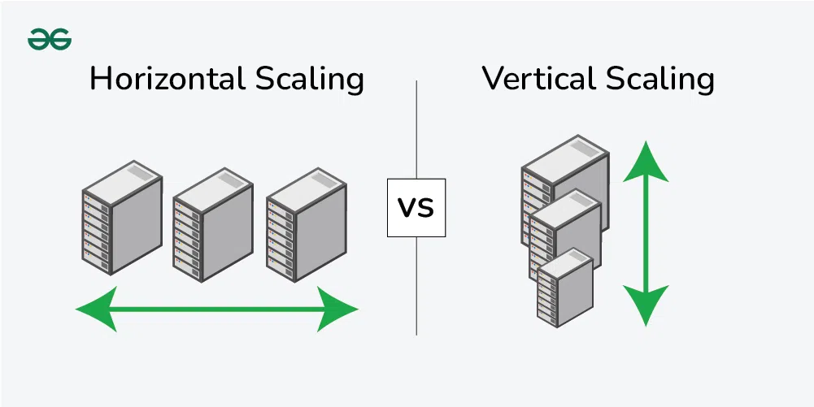
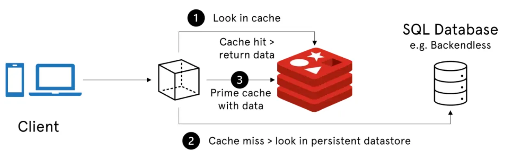

# system-design-lab

## Phase 1 - System Working

### Request Flow

- The Client sends the HTTP request to the API Gateway
- The API Gateway receives the request and validate client authenticates
- The API Gateway forward the request to the core services
- The services recieves the request and perform the operationa and execute the bussines logics
- The Core services returns the response to the API Gateway
- Finally the API Gateway returns the response to the client

### API Communication Boundaries

- Client can only communicate with the API Gateway
- API Gateway sends and receives request and response from core services
- Services communicate with the Database to execute the commands
- Databases does not expose themself to the API Gateways or the client

### What breaks if core service is down?

- API Gateway receives the request from the client.
- Gateway try to forward the request to the services
- Due to services are unavilable, the request is failed
- The API Gateway returns error status 50X status code that might be a bad request or service unavailable

### What breaks if database stops?

- The API gateway forwards the reques to the service
- The service try to access the database
- Due to database is unavailable, the service fails to execute the command
- The service returns the bad request Error to the API Gateway
- The API Gateway forward the error status to the client

### Bottleneck Identification

- core service is single point of failure there is no backup.
- Database is the single shared dependency
- Any increase in the traffic leads to the increase load on the core services

### Non Goals

- No Horizontal scaling
- No caching
- No asychronous processing
- No fault tolerance

---

## Phase 2 - Horizontal scale

### How Horizontal scaling works

- Due to increase in traffics single instance can't handle all request
- Now increase the number of instance
- So the load on the single instance is reduced and distributed on other instance
- By increasing the number of same services which can handle request easly

### Architecture of Horizontal scaling

- Client sends the HTTP request to API gateway
- The API gateway also acts as a loadbalancer
- This gateway redirects the request to all instance equally
- The core service process the request and return the response to the gateway
- The gateway sends the response to the client

### Failure scenarios: One Instance is down

- API gateway still starts to receive the request
- The down Instance is skipped
- The other instance starts to serve the request
- Client may experince the little downtime or the no DTM

### Bottleneck scenarios

- Still the API gateway is the single point of failure
- client may experience some latency due to laod balance
- Database remains shared dependency

---

## Phase 3 - Caching

> Caching is a storing of frequently used data which avoid unnessary data retrival from DB

### Why caching introduced

- Database becomes bottleneck under high read traffic
- Many users try to retirve the same data from DB repeatedly
- Fetching data from the memory is efficient than the DB to avoid load on it
- Caching reduces the over load on the DB and increase the response time

### Caching work flow

- client sends the request through API gateway
- The API gateway redirects the request to the desired services
- The services the checks the cache for the request data
- If cache hit:
  - Returns the data from the cache
- If cache miss:
  - Core service query the database
  - The database runs the query and returns the data to the service
  - Then the returned result is stored in the cache
  - so if next time client request the same data the data is returned from the cache
  - The response is returned to the client through the gateway

### Cache Behaviour

- If cache hit:

  - low latency
  - not interaction with the DB

- If cache miss:
  - high latency
  - need to query the DB

### Failure scenarios: cache down

- If cache is down the core service won't look up cache for data
- higher latency due to quering DB
- System becomes function but slower
- Database load increases

### New problems introduced

- cache data might become stale (old)
- cache eviction policies may remove usefull data while still it required
- cache introduces as additional infrastructure and maintenance
- Incorrect cache usage leads to data inconsistency

### caching strategies

- 

- Cache Aside
- Write through
- Write behind
- Read through

---

## Phase 4 - Async and Queues

### What is Async?

> Async refers to multiple works are done in parallel, that means if the system was sync the client need to send the HTTP request to complete the process and wait until that request is completed, but in async the client doesn't need to wait for the work to complete instead client can spot on another work.

### What is queues?

> Queue are the system design strategies to overcome the high traffice loads on the core services and sudden spike on the service, the queue consumes the works and it can handle later.

### Examples!

- when client downloaded some file on the desired web page
- When client sends the request to download the file
- The file starts to download and the email notification must be sent to the client
- That he has downloaded the file from the web page
- After Downloading the service invoke the email service to send the email
- So waiting till to send the email leads to some latency issues
- so the email sending work is pushed to the queue so later on the work is executed in background
- while the user can do his other works on the web instead waiting for the email to complete its work

### Why Async processing is introduced?

- some operation might take more time and that process should not block the request
- It avoids the overload on the service and makes that process to work later
- sync process increased the latency and reduce the throughput
- queue absorbs the traffic spikes and smooth system load
- Async process helps to improve system availability and resilience

### Work flow (Asynchronous)

- client sends the request to the API Gateway
- API Gateway routes the request to the core service
- core service process the request
- core service push the task to the queue
- core service immediately returns a response to the client
- Then the worker consumes the message from the queue and perform the actull work

### What client can expect change?

- client receive the response quickly
- The response indicates that the request is accepted, but not completed
- The final result may availale later

### New problem introduced

- The work is not immediate
- Debugging becomes hard
- One process can process more than one time
- The works are processed out of order
- Monitoring becomes critical

### Failure scenarios: Worker is down

- Still the request is accepted from the core service
- Work is pushed to the queue
- No work is processed until the worker is recovered

### Failure scenarios: Queue is down

- core service cannot enqueue the work
- The request must work in the synchronous way
- system availability is reduced

## Phase 5 - Timeout, Retries, and Backpressure

#### What is Timeout?

> Timeout is the maximum time waiting for the operation

### Usecase of Timeout

- If the timeout excides it fails the request
- It free the resources
- It prevent cascading failures
- Failing fast allows systems to recover

### Without timeouts

- Threads get stuck
- Resourses get overwhelmed
- system stop responding to the request
- It might leads to the resources exhaustion

#### What is Retry?

> If the system takes too much time to respond the timeout function fails the request and it tries to retry the request

### Why retries are dangerous

- retries increases the load on already failing services
- Finally the resources might get stuck and fails to respond
- Blind retries may cause cascading failures

#### What is backpressure?

> Backpressure meaning that it slows down the request comming from the client when the system is overloaded

### Why Backpressure is requried?

- system have finite
- accepting unlimited resources leads to the resource exhaustion
- backpressure helps by rejecting the request and delaying them

### Failure scenarios: backpressure down

- request are accepted faster they are processed
- queues are unbounded
- memory disk will be exhausted

---

## Phase 6 - Observability

> How do we know what happening in the system when things go wrong

### Pillars of observability

- Metrics
- Logs
- Traces

### Why observability is needed

- Distributed system often fail in some condition
- The problems cannot be resolved from the client side
- Observability used to identify the bottlenecks and point of failures
- monittoring used to faster recovery and safer scaling

### Logs

- Logs capture the discrete information in the file
- Each service need to log the success and failure of the request
- Logs are helps us to understand what happend during the failure

### Metrics

- Metrics are the numerical measurement of the application
- It may includes the error rate, request rate, and latency
- Metrics helps to identify the trends and abnormal behaviour in the system

### Trace

- Traces shows how the single request flow through multiple services
- They helps to identify the slow componenets
- It helps in debugging the issue and latency issues

### Failure scenarios: Missing observability

- Can't identify the root cause like which part of the service causing error
- Engineer needed more time to debug the error manually
- Recovery time increases significantly
